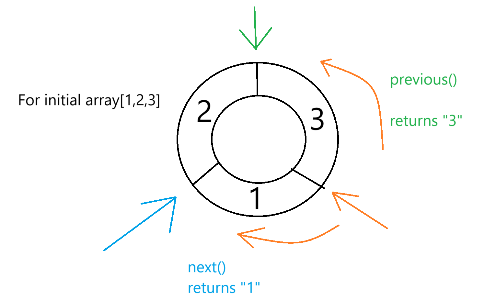
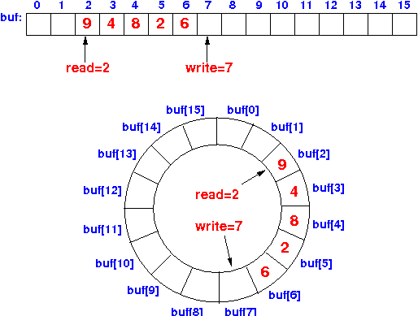

# Circular tuesday

Make tasks in **task** branch

If you stuck ask a question or check **completed** branch

### Warmup _15 min_
1) Go to [CircularList](src/main/java/kt/tuesday/warmup/CircularList.java) 
2) Implement 2 methods and constructor without using collection API
   1) 🔥 provide one line solution for each method
3) Test your implementation with [CircularListTest](src/test/java/kt/tuesday/warmup/CircularListTest.java)

### Circular list visualisation

### Assignment 
1) Go to [ArrayQueue.java](src%2Fmain%2Fjava%2Fkt%2Ftuesday%2Ftask%2FArrayQueue.java)
2) Implement resizeable array queue based on circular buffer, you should implement methods down to peek()
3) Test your implementation with [ArrayQueueTest.java](src%2Ftest%2Fjava%2Fkt%2Ftuesday%2Ftask%2FArrayQueueTest.java)
4) 🔥 If you completed task try to implement other methods below peek()
5) 🔥 Check your implementation with [ArrayQueueExtraMileTest.java](src%2Ftest%2Fjava%2Fkt%2Ftuesday%2Ftask%2FArrayQueueExtraMileTest.java)

### Circular buffer example
